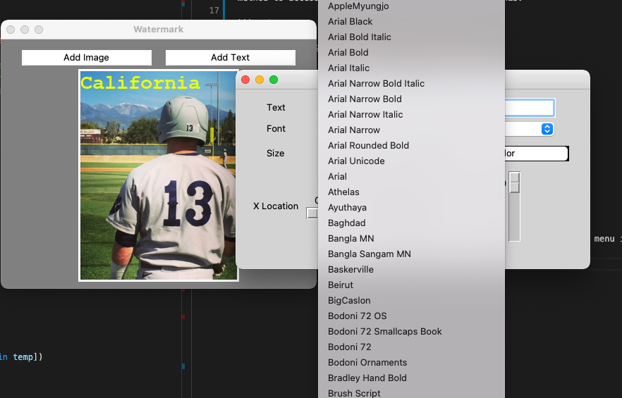

## Python Watermark GUI

UI look:


to create an image that looks like:


## Issue Resolution

There was great difficulty in trying to get different fonts for the `draw.text(font=font)` Pillow method. The truetype in the font (`font = ImageFont.truetype(font_style, 15)`) is actually a truetype font style that is located on your computer. To access these fonts, there needed to be a file path to access them. Like this:


Therefore, the fonts the computer are located in `'/System/Library/Fonts/Supplemental'`. After figuring this out, a method to access all the file paths was need; like this:

```python
import os
font_start = '/System/Library/Fonts/Supplemental'
fonts = {}

def get_fonts():
    font_array = []
    with os.scandir(font_start) as entries:
        for entry in entries:
            if entry.is_file():
                font_array.append(entry.name)
    font_array.sort()
    for font in font_array:
        name = font.split(".")[0]
        fonts[name] = f"{font_start}/{font}"
```

The font dictionary was then able to populate the font-style dropdown menu in TK. To achieve:

